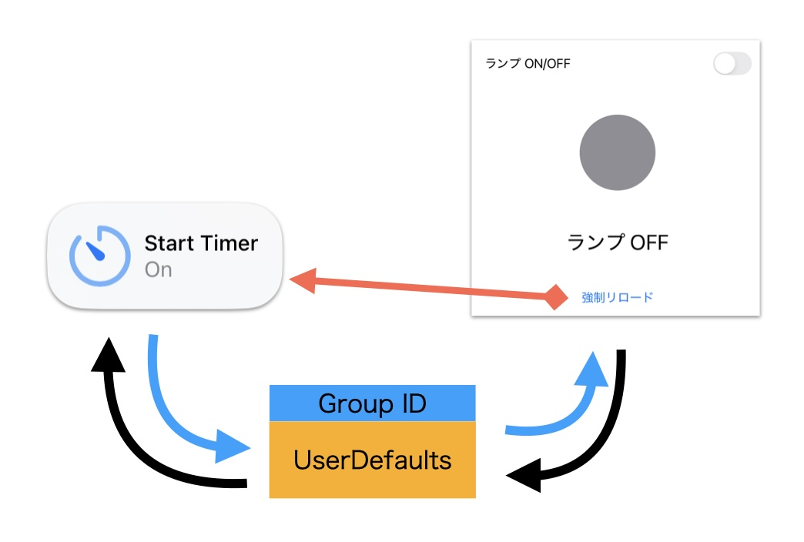

# Appleサンプルコードを使用したウィジェットとアプリの連携例
  　　

Appleのサンプルコードをベースにした、ウィジェットと本体アプリの連携サンプルです。ウィジェットまたは本体アプリで操作した状態を、**グループIDを使用したUserDefaults**に保存し、ウィジェットと本体アプリが**リアルタイムに連携しているように振る舞います**。  

**注意**: 実際にはリアルタイムでの更新ではありません。  

## 環境
- Xcode 16.3  
- iOS 18.3  
- グループID使用のためapple developer契約(有料)が必要 多分・・。  
  
## 連携の流れ  
- ウィジェットから本体  
  1. ウィジェットから操作: ユーザーがウィジェット内でランプのオン/オフを切り替えると、その状態はUserDefaultsに保存  
  2. アプリ起動、バックからフォアに遷移すると、グループIDを使用したUserDefaultsにアクセスし、状態を表示  
- 本体からウィジェット  
  1. 本体アプリのランプのオン/オフを切り替えると、その状態をUserDefaultsに保存します。この状態ではウィジェットの表示に反映されない  
  2. 強制リロードボタンをタップすると、ウィジェットの最描写が実行されます。理解する為に専用ボタン設けました。  
  3. ウィジェットの再描写が実行されグループIDを使用したUserDefaultsにアクセスし、状態が即座に反映されます。　　
- グループIDによる共有　　
  1. グループIDを使用したUserDefaultsにアクセスがミソ　　